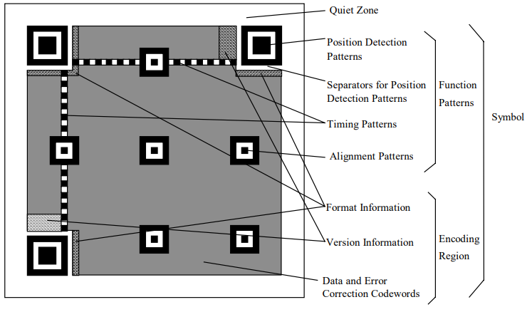
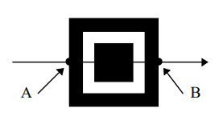
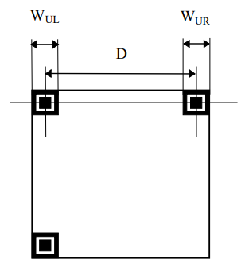
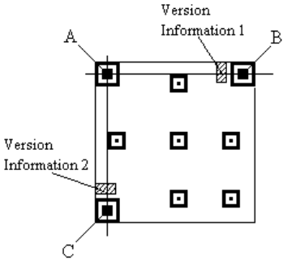
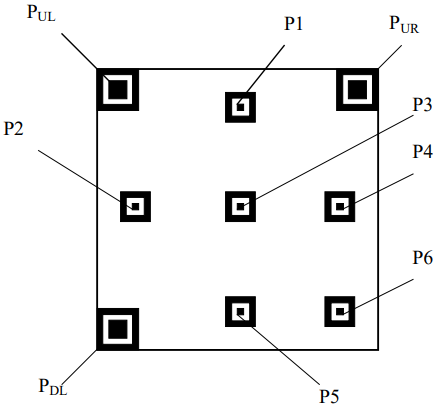
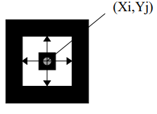
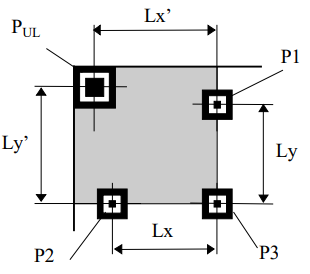
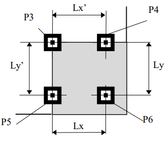

# QR Reader

## Tabla de contenido  
* [Algoritmo de decodificación](#Algoritmo-de-decodificación)

## Algoritmo de decodificación

</img>  
Estructura de código QR versión 7

1. Convertir la imagen a blanco y negro utilizando un algoritmo de
   umbralizacion.

2. Localizar los tres patrones de detección de posición ubicados en
   tres de las cuatro esquinas del símbolo.

   1. Al detectar un área candidata, guardar la posición del primer
      y último punto A y B, respectivamente, en los que una línea de
      píxeles en la imagen encuentra los bordes exteriores del patrón
      de detección de posición. Repetir esto para las
      líneas de píxeles adyacentes en la imagen hasta que se hayan
      identificado todas las líneas que cruzan el cuadro central del
      patrón de detección de posición en el eje X de la imagen.

      </img>
   
   2. Repetir el paso a) para las columnas de píxeles que cruzan el 
      cuadro central del patrón de detección de posición en el eje Y
      de la imagen.
  
   3. Localizar el centro del patrón. Constrir una línea a través de
      los puntos medios entre los puntos A y B en las líneas de
      píxeles más externas que cruzan la caja central del patrón de
      detección de posición en el eje x. Construir una línea similar a
      través de los puntos A y B en las columnas de píxeles más
      externas que cruzan la caja central en el eje y. El centro del
      patrón se encuentra en la intersección de estas dos líneas.

   4. Repetir los pasos del a) al c) para encontrar los dos patrones
      de deteccion de posicion faltantes. 

3. Determine la orientación del símbolo analizando las coordenadas del
   centro del patrón de detección de posición para identificar qué
   patrón es el patrón superior izquierdo en el símbolo y el ángulo de
   rotación del símbolo.

4. Determinar: 
   
   1. La distancia D que cruza el ancho completo del símbolo entre el
      centro del patron de detección de posición superior izquierda y
      el patrón de detección de posición superior derecha.
   
   2. El ancho de los dos patrones, Wul y Wur.

      </img>

5. Calcular la dimensión nominal "X" del símbolo.  
   X = (Wul + Wur)/14

6. Determinar, provisionalmente, la versión V del símbolo.  
   V = [(D/X) - 10]/4

7. Si la versión provisional es 6 o menos, entonces esta es la versión       
   definitiva. Si es 7 o más, decodificar la información de la versión
   de la siguiente manera:
   
   1. Dividir el ancho Wur del patrón de detección de posición
      superior derecho por 7 para calcular el tamaño del módulo CPur.  
      CPur = Wur / 7
   
   2. Encontrar las líneas guía AC y AB que pasan por los centros de
      los tres patrones de detección de posición. La cuadrícula de
      muestreo para el área uno de información de versión se determina
      en base a líneas paralelas a las líneas de guía, las coordenadas
      centrales de los patrones de detección de posición y el tamaño
      del módulo CPur.

      </img>
   
   3. Determine la versión detectando y corrigiendo errores, si los
      hay, con base en la corrección de errores BCH aplicada a los
      módulos de información de versión, definidos en el Anexo D.
   
   4. Si se detectan errores que exceden la capacidad de corrección de
      errores, calcule el ancho del patrón Wdl del patrón de detección
      de posición inferior izquierdo y siga un procedimiento similar a
      los pasos 7.1, 7.2 y 7.3 anteriores para decodificar la
      información de versión 2.

8. Para determinar las cuadrículas de muestreo de la versión 2 en
   adelante se requiere la coordenada central de cada patrón de
   alineación.

   </img>

   1. Dividir el ancho (Wul) del patrón de detección de posición
      superior izquierda (Pul) por 7 para calcular el tamaño del
      módulo CPul.  
      CPul = Wul / 7
   
   2. Determinar las coordenadas centrales provisionales de los
      patrones de alineación P1 y P2, basándose en la coordenada del
      centro A del patrón de detección de posición superior izquierda
      (Pul), las líneas paralelas a las líneas guía AB y AC obtenidas
      en 7.3, y el tamaño del módulo CPul.
   
   3. Escanear el contorno del cuadrado blanco en el patrón de
      alineación P1 y P2 a partir del píxel de la coordenada central
      provisional para encontrar las coordenadas centrales reales Xi e
      Yj.

      </img>
   
   4. Estimar la coordenada central provisional del patrón de
      alineación P3, basándose en la coordenada central del patrón de
      detección de posición superior izquierda Pul y las coordenadas
      centrales reales de los patrones de alineación P1 y P2 obtenidos
      en 8.3
   
   5. Encontrar la coordenada central real del patrón de alineación P3
      siguiendo el mismo procedimiento que en 8.3.
   
   6. Encontrar Lx, que es la distancia de centro a centro de los
      patrones de alineación P2 y P3, y Ly, que es la distancia de
      centro a centro de los patrones de alineación P1 y P3. Dividir
      Lx y Ly por el espacio definido de los patrones de alineación
      para obtener los tonos de módulo CPx en el lado inferior y CPy
      en el lado derecho en el área superior izquierda del símbolo.  
      
      CPx = Lx / AP  
      CPy = Ly / AP  
      
      Donde AP es el espacio en los módulos de los centros de patrones
      de alineación (ver Tabla E.1)  

      De la misma forma, encontrar Lx', que es la distancia horizontal
      entre las coordenadas centrales del patrón de detección de
      posición superior izquierda (Pul) y las coordenadas centrales del
      patrón de alineación P1, y Ly', que es la distancia vertical
      entre el centro coordenadas del patrón de detección de posición
      superior izquierda (Pul) y las coordenadas centrales del patrón
      de alineación P2. Dividir Lx' y Ly' por la fórmula a continuación
      para obtener los tonos de módulo CPx' en el lado superior y CPy'
      en el lado izquierdo en el área superior izquierda del símbolo.

      CPx’ = Lx’ / (Coordenada de columna del módulo central del patrón de alineación P1 - Coordenada de columna del módulo central del patrón de detección de posición superior izquierda Pul)

      CPy’ = Ly’ / (Coordenada de fila del módulo central del patrón de alineación P2 - Coordenada de fila del módulo central del patrón de detección de posición superior izquierda Pul)

      </img>
   
   7. Determinar la cuadrícula de muestreo que cubre el área superior
      izquierda del símbolo en función de los tonos de módulo CPx,
      CPx', CPy y CPy' que representan cada lado en el área superior izquierda del símbolo.
   
   8. De la misma manera, detemine las cuadrículas de muestreo para el
      área superior derecha (cubierta por el patrón de detección de
      posición superior derecho PUR, patrones de alineación P1, P3 y P4) y el área inferior izquierda (cubierta por el patrón de detección de posición superior derecha PUR, patrones de alineación P2 , P3 y P5) del símbolo.

   9. Para el patrón de alineación P6, calcular su coordenada central            provisional a partir de los pasos de módulo CPx' y CPy', cuyos
      valores se obtienen a partir de los espacios de los patrones de alineación P3, P4 y P5, líneas guía que pasan por los centros de
      los patrones de alineación P3 y P4, y P3 y P5 respectivamente, y
      las coordenadas centrales de estos patrones.

      </img>
   
   10. Repetir los pasos 8.5 a 8.8 para determinar la cuadrícula de
      muestreo para el área inferior derecha del símbolo.
   
   11. Se aplicarán los mismos principios para determinar las
      cuadrículas de muestreo para cualquier área del símbolo que no
      esté cubierta.

9. Muestree el píxel de la imagen en cada intersección de las líneas
   de la cuadrícula y determine si está blanco o negro según el Umbral global. Construya una matriz de bits que mapee los píxeles negros
   como cero y los píxeles blancos como 1.

10. Decodifique la información de formato adyacente al patrón de
   detección de posición superior izquierdo para obtener el nivel de corrección de errores y el patrón de máscara aplicado al símbolo.
   Si se detectan errores que exceden la capacidad de corrección de
   errores de la información de formato, siga el mismo procedimiento
   para decodificar la información de formato adyacente a los patrones
   de detección de posición superior derecha e inferior izquierda.

11. XOR el patrón de máscara con la región de codificación del símbolo
   para liberar el enmascaramiento y restaurar los caracteres del
   símbolo que representan datos y palabras de código de corrección de errores. Esto invierte el efecto del proceso de enmascaramiento
   aplicado durante el procedimiento de codificación.

12. Determine las palabras clave del símbolo de acuerdo con las reglas
   de ubicación en 8.7.3.

13. Reorganice la secuencia de palabras de código en bloques según sea           necesario para la Versión del símbolo y el Nivel de corrección de
   errores, invirtiendo el proceso de entrelazado definido en 8.6. paso 3.

14. Siga el procedimiento de detección de errores y decodificación de            corrección en el Anexo B para corregir errores y borrados hasta la            capacidad de corrección máxima para la versión del símbolo y el
   Nivel de corrección de errores.

15. Restaure el flujo de bits del mensaje original ensamblando los
   bloques de datos en secuencia.

16. Subdivida la secuencia de bits de datos en segmentos, cada uno de
   los cuales comienza con un indicador de modo y cuya longitud está determinada por el indicador de recuento de caracteres que sigue al indicador de modo.

17. Decodifica cada segmento de acuerdo con las reglas del modo vigente.